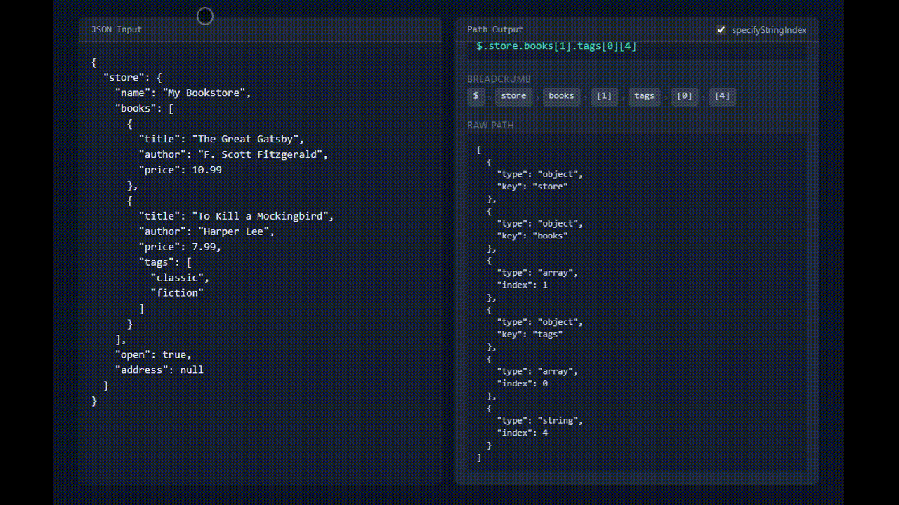

# json-cursor-path


Get the JSONPath at any cursor position in JSON text. Perfect for editor plugins, JSON tools, and autocomplete features.

[**Try the interactive demo**](https://7ph.github.io/json-cursor-path/)



## Getting started

1. Install `json-cursor-path`

   ```bash
   npm i --save json-cursor-path
   ```

2. Import JsonCursorPath using ES import

   ```js
   import { JsonCursorPath } from "json-cursor-path";
   ```

3. Create an instance and pass the raw JSON file

   ```js
   const cursorPath = new JsonCursorPath(
     '{\n  "key": [\n    "val1",\n    "val2"\n  ]\n}'
   );
   ```

4. Get the path corresponding to a cursor position

   ```js
   console.log(cursorPath.get(20));
   /**
    * Output: "$.key[0]"
    */

   console.log(cursorPath.get(20, true));
   /**
    * Output: [
    *    { type: 'object', key: 'key' },
    *    { type: 'array', index: 0 }
    * ]
    */
   ```

## Performance

`O(n)` (cost of traversing the JSON until the specified cursor)
